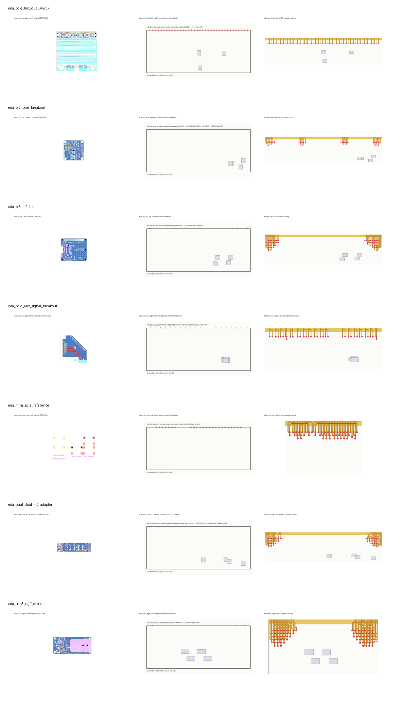

# Real EDA File Parsing and Tail-Board Routing Experiment

## Environment

- KiCad CLI: `10.0.2`
- Python parsing: built-in text/S-expression parser, lightweight Gerber/Excellon coordinate extraction, PIL/pypdfium2 rendering.
- Scope: KiCad board files plus Gerber/Excellon manufacturing files where available; ODB++/IPC-2581 are reserved for future expansion.

## Parsing Evidence

| Case | EDA source | Connector footprint | Pins | Gerber files | Drill files | Drill hits | Export |
|---|---|---|---:|---:|---:|---:|---|
| eda_pcie_test_dual_ww37 | mengstr/PCIeTestPCB | `matseng:PAD64-1.5_1.0` | 64 | 0 | 0 | 0 | kicad_cli |
| eda_pi5_pcie_breakout | m1geo/Pi5_PCIe | `10018783-11200TLF:AMPHENOL_10018783-11200TLF` | 36 | 0 | 0 | 0 | kicad_cli |
| eda_pi5_m2_hat | m1geo/Pi5_PCIe | `ngff:AMPHENOL_MDT420M03001` | 69 | 0 | 0 | 0 | kicad_cli |
| eda_pcie_aux_signal_breakout | Supercookiegaming/PCIe-Aux-Signal-Breakout | `PCIexpress:PCIexpress_x1` | 36 | 9 | 2 | 52 | kicad_cli |
| eda_mini_pcie_reference | mithro/kicad-mini-pci-express | `mpcie:mpcie-full-card` | 52 | 0 | 0 | 0 | kicad_cli |
| eda_coral_dual_m2_adapter | serg987/coral-dual-m2-adapter-pcb | `nvme_ae_to_m:Conn_TE-M.2-0.5-67P-doublesided_TypeE` | 68 | 0 | 0 | 0 | kicad_cli |
| eda_usb3_ngff_carrier | themainframe/5g-m2-usb3-interface-pcb | `footprint:TE_2199119-3` | 69 | 11 | 2 | 425 | kicad_cli |

## Quantitative Result

| Case | Baseline routability/% | Proposed routability/% | Baseline area/% | Proposed area/% | Baseline violations | Proposed violations |
|---|---:|---:|---:|---:|---:|---:|
| eda_pcie_test_dual_ww37 | 98.44 | 100.00 | 73.91 | 11.37 | 1 | 0 |
| eda_pi5_pcie_breakout | 100.00 | 100.00 | 74.40 | 22.85 | 0 | 0 |
| eda_pi5_m2_hat | 37.68 | 100.00 | 72.02 | 44.18 | 43 | 0 |
| eda_pcie_aux_signal_breakout | 100.00 | 100.00 | 73.29 | 16.87 | 0 | 0 |
| eda_mini_pcie_reference | 100.00 | 100.00 | 70.10 | 22.55 | 0 | 0 |
| eda_coral_dual_m2_adapter | 36.76 | 100.00 | 72.36 | 38.88 | 43 | 0 |
| eda_usb3_ngff_carrier | 37.68 | 100.00 | 70.00 | 37.92 | 43 | 0 |

## Aggregate

- Average routability: 72.94% -> 100.00%.
- Average area ratio: 72.30% -> 27.80%.

