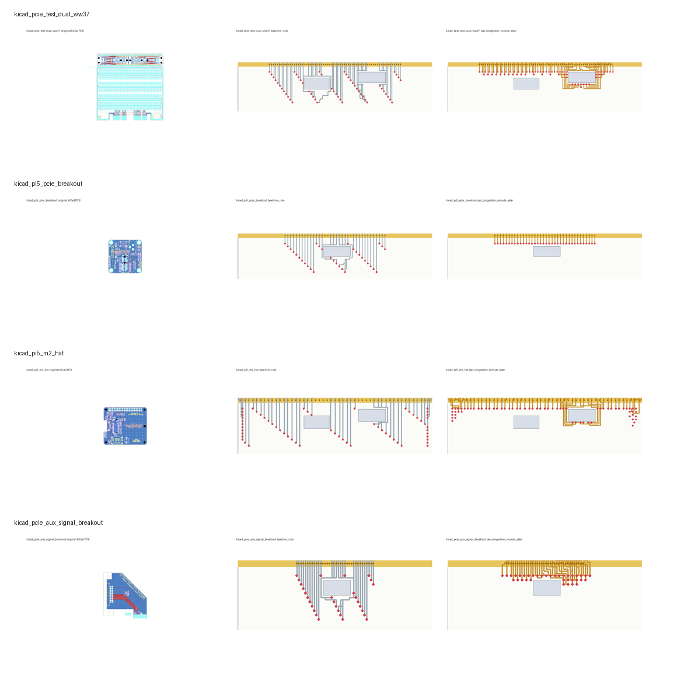

# Public KiCad PCB Tail-Board Routing Experiment

## Method

KiCad CLI version: `10.0.2`. The script first detects `KICAD_CLI`, then `kicad-cli` in `PATH`, then `/Applications/KiCad/KiCad.app/Contents/MacOS/kicad-cli`. Original PCB screenshots are exported through KiCad CLI as SVG/PDF and rasterized from the PDF. If KiCad CLI is unavailable, the experiment falls back to text parsing only and marks the report accordingly.

Public KiCad PCB projects were searched and cloned locally. For each PCB, the script selects the most connector-like footprint by keyword and pad count, extracts the pin count and representative pitch, abstracts component/keepout pressure as rectangular obstacles, and runs the same C++ tail-board placement/routing prototype.

The `baseline_rule` method is used as the manual/experience-style baseline: it places test points in regular rows below the edge connector. The proposed method is `pso_congestion_reroute_astar`, which uses PSO-Hanan placement and congestion-aware rip-up/reroute A*.

## Quantitative Comparison

| Case | Pins | Baseline routability/% | Proposed routability/% | Baseline area/% | Proposed area/% | Baseline violations | Proposed violations | Baseline wire/mm | Proposed wire/mm | Original PCB | Comparison |
|---|---:|---:|---:|---:|---:|---:|---:|---:|---:|---|---|
| kicad_pcie_test_dual_ww37 | 64 | 82.81 | 100.00 | 51.50 | 30.16 | 11 | 0 | 1107.00 | 803.00 | [original_kicad_pcb.png](../../results/kicad_cases/kicad_case_01_pcie_test_dual_ww37/original_kicad_pcb.png) | [comparison_original_baseline_algorithm.png](../../results/kicad_cases/kicad_case_01_pcie_test_dual_ww37/comparison_original_baseline_algorithm.png) |
| kicad_pi5_pcie_breakout | 36 | 91.67 | 100.00 | 40.83 | 6.80 | 3 | 0 | 641.00 | 252.00 | [original_kicad_pcb.png](../../results/kicad_cases/kicad_case_02_pi5_pcie_breakout/original_kicad_pcb.png) | [comparison_original_baseline_algorithm.png](../../results/kicad_cases/kicad_case_02_pi5_pcie_breakout/comparison_original_baseline_algorithm.png) |
| kicad_pi5_m2_hat | 69 | 62.32 | 73.91 | 75.66 | 40.23 | 26 | 18 | 902.00 | 577.00 | [original_kicad_pcb.png](../../results/kicad_cases/kicad_case_03_pi5_m2_hat/original_kicad_pcb.png) | [comparison_original_baseline_algorithm.png](../../results/kicad_cases/kicad_case_03_pi5_m2_hat/comparison_original_baseline_algorithm.png) |
| kicad_pcie_aux_signal_breakout | 36 | 80.56 | 100.00 | 32.94 | 12.39 | 7 | 0 | 579.00 | 393.00 | [original_kicad_pcb.png](../../results/kicad_cases/kicad_case_04_pcie_aux_signal_breakout/original_kicad_pcb.png) | [comparison_original_baseline_algorithm.png](../../results/kicad_cases/kicad_case_04_pcie_aux_signal_breakout/comparison_original_baseline_algorithm.png) |

## Aggregate Result

- Average routability improved from 79.34% to 93.48%.
- Average tail-board area ratio reduced from 50.23% to 22.39%.
- Average legality violations reduced from 11.75 to 4.50.
- The M.2 HAT case remains partially unrouted because its extracted connector density and abstracted keepouts create a deliberately constrained case; the proposed method still improves routability, area ratio, violations and congestion peak compared with the baseline.

## Screenshot Contact Sheet

## Source Details

See [sources.md](sources.md) for repository URLs, licenses, PCB files and selected footprints.
